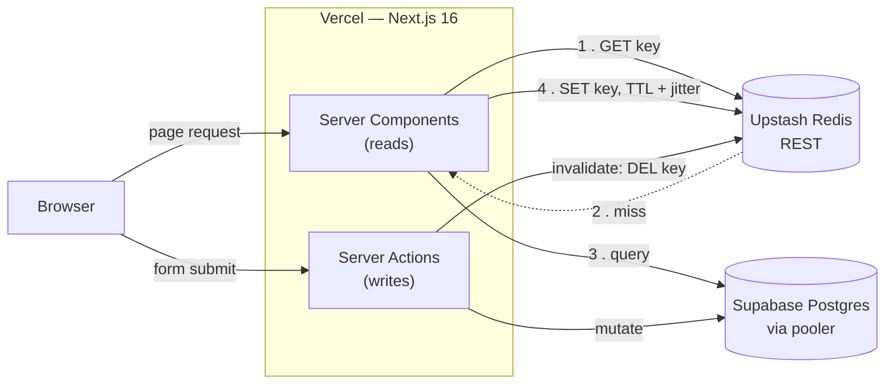

# subscription-tracker

A subscription tracking app with authentication, CRUD, and Redis caching.

**Live demo:** https://subscription-tracker-umber.vercel.app

## Features

- Google OAuth sign-in (NextAuth v5)
- Subscription CRUD with per-user data isolation
- IDOR protection — every read and write is scoped by owner
- Redis caching: cache-aside reads, serialized payloads, and cache-granularity optimization (monthly total derived from the cached list)
- Zod input validation

## Architecture

**Read (cache-aside):** Server Component checks Redis → on a miss, queries Postgres, writes the serialized result back to Redis (with jittered TTL), and returns it.
**Write:** a Server Action mutates Postgres, then invalidates the user's cache key so the next read repopulates it. See [ADR-002](docs/adr/002-caching-strategy.md) and [ADR-003](docs/adr/003-cache-resilience.md).

## Tech Stack

- Next.js 16 (App Router)
- React 19
- TypeScript
- Prisma 7
- Supabase PostgreSQL
- NextAuth v5
- Upstash Redis
- Tailwind CSS
- Vitest
- Vercel

## Status

Deployed and live. Implements authentication, subscription CRUD, and three Redis
caching patterns (cache-aside, serialization, and cache-granularity optimization).

## Architecture Decisions

- [ADR-001: Technology Stack](docs/adr/001-tech-stack.md)
- [ADR-002: Caching Strategy](docs/adr/002-caching-strategy.md)
- [ADR-003: Cache Resilience — Stampede, Avalanche, and Penetration](docs/adr/003-cache-resilience.md)
